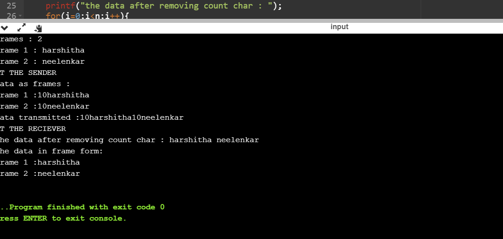

# Experiment 1

## Aim of the Experiment
To impliment data link layer framing techniques such as
i.character count ii. character stuffing and iii. bit stuffing

### step by step procedure of experiment
1.Read the number and lenght of frames.\
2.The frames with the characters are printed combined.\
3.Frames printed seperately.

### Output

